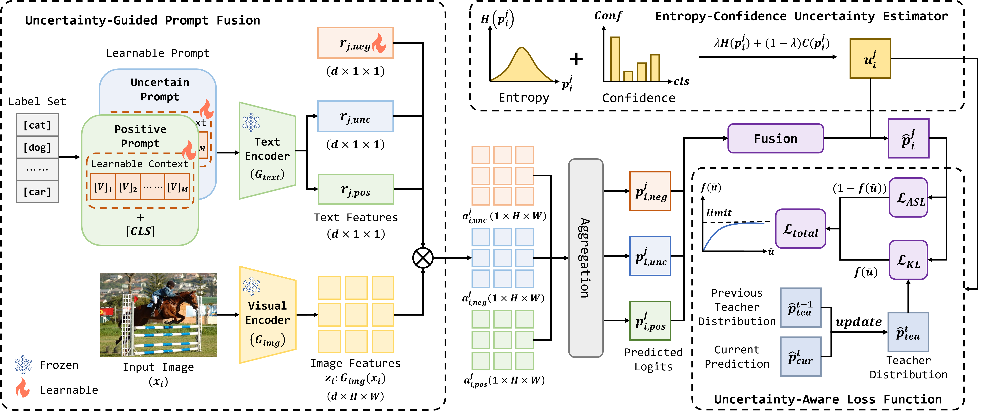

# UncertaintyCoOp: Uncertainty-Aware Prompt Learning for Multi-Label Recognition with Incomplete Annotations

[English](README.md) | [中文](README_CN.md)

The paper has been accepted.

## Introduction

Multi-label image recognition typically assumes exhaustive annotations, whereas real-world datasets such as MS-COCO and PASCAL VOC often contain missing or incorrect labels. Treating unlabeled categories as negatives introduces false-negative supervision, leading to degraded performance under partial annotations. To address this issue, we propose Uncertainty-Guided Context Optimization (UncertaintyCoOp), a prompt learning framework that explicitly models prediction uncertainty for partial-label multi-label recognition.

UncertaintyCoOp consists of three components: (1) an entropy-confidence hybrid uncertainty estimator capturing epistemic and aleatoric uncertainty, (2) an uncertainty-guided prompt fusion mechanism combining positive, negative, and uncertain prompts, and (3) an uncertainty-aware loss with a momentum-updated teacher to ensure stable optimization under noisy supervision.

## Motivation


Illustration of incorrect and missing annotations in VOC and COCO datasets. Each example (a-d) compares the dataset ground truth (GT) with the actual image content (Actual). $\checkmark$ and $\times$ denote present and absent labels, respectively. Incorrect and missing annotations are highlighted in dark blue and gray dashed boxes, respectively.

In practical multi-label image recognition tasks, dataset annotations are often incomplete and inaccurate. This annotation noise severely affects model performance because traditional learning methods incorrectly treat missing labels as negative samples, leading models to learn incorrect knowledge. Our approach addresses this problem by explicitly modeling prediction uncertainty.

## Framework



Illustration of the proposed UncertaintyCoOp framework for partial-label MLR. For each category, a positive prompt, an uncertainty prompt, and a learnable negative embedding interact with image patch features to produce three directional predictions. The entropy-confidence uncertainty estimator generates an uncertainty coefficient, which adaptively fuses the multi-branch predictions and further guides the uncertainty-aware loss function with a reliability teacher distribution.

## Environment Setup

### 1. Create conda environment

```bash
conda env create -f environment.yaml
conda activate uncertaintycoop
```

### 2. Install Dassl

Follow the instructions at https://github.com/KaiyangZhou/Dassl.pytorch to configure Dassl.

### 3. Verify CUDA and Dassl availability

# Check Dassl
```bash
python -c "import importlib.util; print('Dassl installed:', importlib.util.find_spec('dassl') is not None)"
```

# Check CUDA
```
python -c "import torch; print('PyTorch version:', torch.__version__); print('CUDA available:', torch.cuda.is_available()); print('Device count:', torch.cuda.device_count()); print('Device name:', torch.cuda.get_device_name(0) if torch.cuda.is_available() else 'No GPU detected')"
```

## Dataset

This project uses VOC2007 and MSCOCO datasets. Please download them from official websites.

### VOC2007 Dataset Structure

```
VOC2007/
    ├── Annotations/          # Annotations (XML, one per image)
    │   ├── 000001.xml
    │   ├── 000002.xml
    │   └── ...
    │
    ├── JPEGImages/          # Original images
    │   ├── 000001.jpg
    │   ├── 000002.jpg
    │   └── ...
    │
    ├── ImageSets/
    │   └── Main/            # Split files (important!)
    │       ├── train.txt
    │       ├── val.txt
    │       ├── trainval.txt
    │       ├── test.txt
    │       │
    │       ├── aeroplane_train.txt
    │       ├── aeroplane_val.txt
    │       └── ... (one for each category)
```

### MSCOCO Dataset Structure

```
coco/
├── annotations/
│   ├── instances_train2014.json
│   ├── instances_val2014.json
│   ├── captions_train2014.json
│   ├── captions_val2014.json
│   ├── person_keypoints_train2014.json
│   └── person_keypoints_val2014.json
│
├── train2014/
│   ├── COCO_train2014_000000000009.jpg
│   ├── COCO_train2014_000000000025.jpg
│   └── ...
│
├── val2014/
│   ├── COCO_val2014_000000000139.jpg
│   ├── COCO_val2014_000000000285.jpg
│   └── ...
```

## Training

### VOC2007

```bash
CUDA_VISIBLE_DEVICES=0 python train.py --config_file configs/models/rn101_adam.yaml --datadir <your_dataset_path> --dataset_config_file configs/datasets/voc2007.yaml --train_batch_size 32 --input_size 448 --lr 8e-2 --max_epochs 50 --loss_w 0.03 -pp 0.9 --csc --method_name uncertaintycoop --warmup_epochs 1
```

### MSCOCO

```bash
CUDA_VISIBLE_DEVICES=0 python train.py --config_file configs/models/rn101_adam.yaml --datadir <your_dataset_path> --dataset_config_file configs/datasets/coco.yaml --train_batch_size 32 --input_size 448 --lr 8e-2 --max_epochs 50 --loss_w 0.03 -pp 0.9 --csc --method_name uncertaintycoop --warmup_epochs 1
```

### Parameter Description

| Parameter | Meaning | Example | Notes |
|-----------|---------|---------|-------|
| config_file | Model configuration file | configs/models/rn101_ep50.yaml | Defines model architecture (e.g., ResNet101), training epochs, optimizer, etc. |
| datadir | Dataset path | ../datasets/mscoco_2014/ | Specifies local dataset directory |
| dataset_config_file | Dataset configuration file | configs/datasets/coco.yaml or voc2007.yaml | Tells the program dataset format, number of categories, etc. |
| input_size | Input image size | 448 | Images will be resized to 448×448 |
| lr | Learning rate | 8e-2 | Controls training update step size |
| loss_w | Loss weight coefficient | 0.03 | Used to balance loss magnitude under different missing ratios |
| pp | Portion of available labels | Between 0 and 1 | 0.5 means only 50% of labels are known (partial label rate) |
| --csc | Class-specific prompts | No value (boolean switch) | Used when pp is small. Enables "class-specific prompts". If not added, uses class-agnostic prompt |

## Validation

### VOC2007

```bash
CUDA_VISIBLE_DEVICES=0 python val.py --config_file configs/models/rn101_adam.yaml --datadir <your_dataset_path> --dataset_config_file configs/datasets/VOC2007.yaml --input_size 448 --pretrained <your_model_path> --csc --method_name uncertaintycoop
```

### MSCOCO

```bash
CUDA_VISIBLE_DEVICES=0 python val.py --config_file configs/models/rn101_adam.yaml --datadir <your_dataset_path> --dataset_config_file configs/datasets/COCO.yaml --input_size 448 --pretrained <your_model_path> --csc --method_name uncertaintycoop
```
